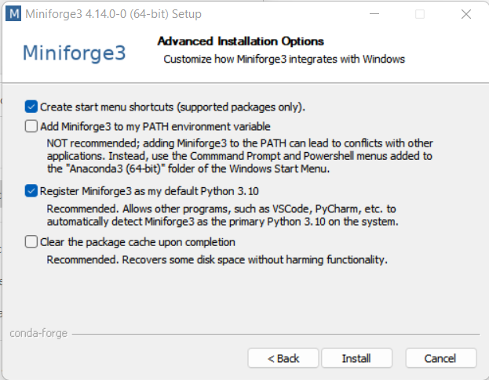
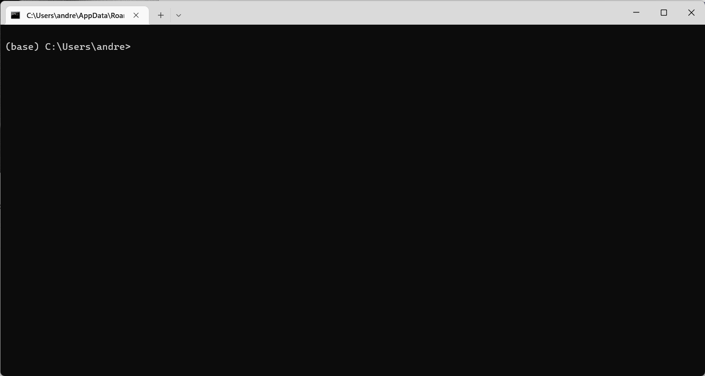

# IMEC 2001 - Herramientas Computacionales 
Ciclo de Talleres <br>
Curso Electivo – Sección 3 <br>
2024-10 – Ciclo 2 <br>

*La parábola de las piedritas.* <br>

*Un hombre que caminaba por el desierto escuchó una voz que le dijo: "Toma algunas piedritas del suelo y ponlas en tu bolsillo, y mañana estarás feliz y triste al mismo tiempo."
El hombre hizo caso. Tomó algunas piedritas del suelo y las guardó en su bolsillo. Al día siguiente, el hombre buscó en su bolsillo y encontró diamantes, rubíes y esmeraldas. Y el hombre estaba feliz y triste al mismo tiempo. Feliz de haber tomado algunas piedritas - triste de no haber tomado más.* <br>

*Lo mismo pasa con la educación*  <br>

## Instalación y configuración de ambiente de cómputo

#### Distribución y Ambiente

Se recomienda instalar [Miniforge](https://github.com/conda-forge/miniforge) como ambiente para instalar Python y las librerías necesarias para la ejecución de los protocolos. Miniforge es una distribución de Python y el administrador de paquetes `conda`, permite fácilmente la configuración de ambientes y la instalación de paquetes desde el repositorio `conda-forge`.

Durante la instalación utilice las opciones recomendadas en las `Advanced Installation Options` como se muestra a continuación.



Luego de descargar e instalar `Miniforge`, inicie el terminal mediante la aplicación `Miniforge Prompt`. Si la instalación se realizó de manera correcta, debe estar en el ambiente `(base)` como se muestra a continuación. 



Se creará un ambiente específico para el curso, el cual llamaremos, por ejemplo, `hc`, y se instalarán los paquetes necesarios. Con este fin abra un terminal con la aplicación `Miniforge Prompt` y desde el ambiente `(base)` realice las siguientes operaciones.

1. Cree el ambiente `hc`:

```terminal
conda create --name hc
```
2. Active el ambiente recien creado:

```terminal
conda activate hc
```
Finalmente instale las librerías requeridas, por ejemplo:

```terminal
conda install numpy scipy pandas matplotlib ipykernel
```

Puede crear un `kernel` para el ambiente recien creado"

```terminal
python -m ipykernel install --user --name hc --display-name "hc"
```